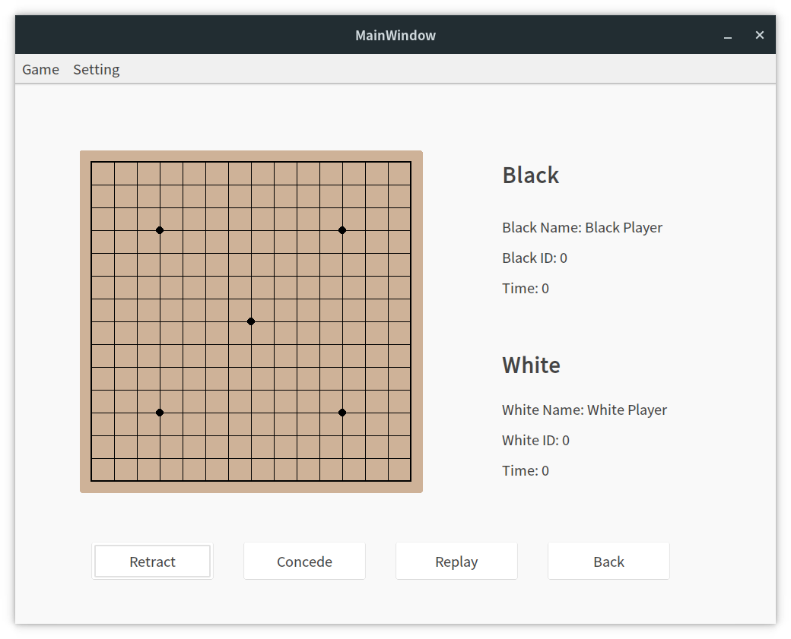

# gobang
A Simple gobang game, which has a client and a server. You can use it play gobang locally or on the network. 



## Build

### Gobang Client

Libs:

- Qt5: https://www.qt.io
- Openjson: https://github.com/openlinyou/openjson
- FiveChess: https://github.com/kimlongli/FiveChess

Dependence:

- gcc/clang
- cmake
- make
- Qt5

 Build:

```shell
git clone https://github.com/Dionysen/gobang.git
cd gobang/gobang-client
mkdir build && cd build
cmake ..
make
```


### Gobang Server

Libs:

- Openjson: https://github.com/openlinyou/openjson

Dependence:

- gcc/clang
- cmake
- make

```shell
git clone https://github.com/Dionysen/gobang.git
cd gobang/gobang-server
mkdir build && cd build
cmake ..
make
```

